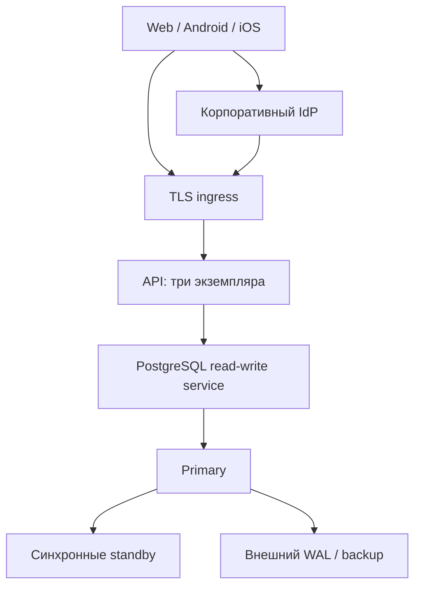

# Архитектура 0.7

## Два режима и один клиент

`src/entry.mjs` выбирает сервер по `DATABASE_URL`. Без него остаётся локальный SQLite (схема 6); с ним — асинхронный PostgreSQL API из `src/enterprise`. HTTP-контракты игры сохранены. SQLite предназначен для одного экземпляра, PostgreSQL — для нескольких процессов с общей базой. Эти базы автоматически не реплицируются друг в друга.

`public/` содержит общий интерфейс карты/кабинетов. MapLibre показывает географию OpenFreeMap и здания, Three.js — игровые объекты. `public/platform.js` отделяет транспорт, геолокацию и SSO от UI. Capacitor собирает те же файлы в Android/iOS вместе с нативным мостом; web использует браузерные API. В мобильном пакете нет удалённого `server.url`.

Ниже целевая схема развёртывания, а не свидетельство уже работающего кластера:

## PostgreSQL

`db.mjs` использует `pg.Pool`, привязывает всю транзакцию к одному соединению, поддерживает вложенные savepoints. Параметры SQL — `$1`, `$2`; пользовательские значения не вставляются как SQL. 64-битные значения преобразуются только в безопасные JavaScript integers. В production TLS проверяет сертификат и имя сервера. Приложение не повторяет автоматически мутации после неопределённого результата COMMIT.

Схема 6 содержит прежние таблицы игроков, карточек, заданий, прогресса, команд и защиты, а также `oidc_states`, `oidc_identities`, `mobile_auth_codes`. В `users` добавлено `password_login_enabled` для аккаунтов только SSO. Миграции выполняются отдельным Job/CLI с advisory lock и checksum; пользовательский runtime не получает DDL-права и не инициирует миграцию при старте.

Сессии, одноразовые коды, MFA challenges, rate limits, позиции и аудит — в общей базе. Локальная память процесса хранит только измерения его запросов и кеш OIDC discovery. Sticky sessions не требуются. Подключение к PostgreSQL указывает на стабильный read-write endpoint управляемого сервиса/CloudNativePG; выбор primary и репликация не реализуются самим Node-сервером.

## Целостность наград и редактирования

В транзакциях повторно проверяется действующая сессия/роль. Сначала блокируется пользователь, затем соответствующие организация/квест/код или команда. Для пользовательских строк используется `FOR NO KEY UPDATE`, для изменяемого квеста/кода — row locks. Completion, расходование кода, XP и аудит коммитятся вместе. Уникальная пара игрок/квест обеспечивает идемпотентный повтор; блокировка квеста сериализует общий лимит разных игроков. Членство защищено уникальным пользователем, размер команды — блокировкой команды.

PATCH требует текущую `version`. Модерация организации изменяет статус связанных квестов и отзывает неиспользованные одноразовые коды. Импорт OSM защищает карточки с владельцами, повышает версии и записывает аудит в той же транзакции. Лимит кампании относится к прохождениям, не к деньгам; выпуск кода не резервирует отдельную награду.

GPS сохраняет серверные ограничения области города, точности, свежести и скорости перемещения. Это контроль ошибок и правил игры, не доказательство присутствия и не надёжная защита от подделки координат.

## Сессии, MFA и SSO

Web: HttpOnly/SameSite=Lax cookie, Secure в production. Native: случайный bearer в памяти приложения, на сервере SHA-256 токена. Access token никогда не передаётся через deep link, в localStorage/Preferences или ответ web-входа. Завершение процесса приложения требует повторного входа.

Сроки и отзыв централизованы. MFA использует зашифрованный TOTP secret, запрет повторного счётчика и одноразовые recovery-коды. Роли из IdP не принимаются. Для существующего администратора после SSO сохраняется проверка локальной MFA; SSO-only пользователь не может стать администратором до отдельного предоставления локального пароля оператором.

OIDC использует поддерживаемый `openid-client`, Authorization Code, PKCE S256, nonce и state, привязанный к HttpOnly cookie браузера. Verifier зашифрован и хранится в PostgreSQL, поэтому начало и callback могут обслужить разные API-реплики. Callback атомарно расходует state, валидирует подпись RS256/JWKS, issuer/audience/срок и nonce. Идентичность — точная пара issuer + subject; email не является доказательством владения локальным аккаунтом.

Мобильный SSO открывает системный браузер. После callback сервер выдаёт двухминутный одноразовый код для `cityquest://auth/callback`; мобильный клиент обменивает его вместе со своим verifier. Только успешный обмен создаёт сессию или локальный MFA challenge. Секретный bearer в URL отсутствует. При потере состояния клиента вход начинается заново. [SSO.md](SSO.md) описывает конфигурацию и явное связывание аккаунтов.

## HTTP, CORS и прокси

Same-origin web и точный список native origins разделены. Для iOS разрешается `capacitor://localhost`, Android — `https://localhost`; wildcard CORS и credentialed cross-origin cookies не используются. Native отправляет `X-CityQuest-Client: native` и bearer. JSON-изменения проверяют origin, Sec-Fetch-Site и Content-Type.

`TRUST_PROXY=none` игнорирует forwarded IP. `loopback` доверяет только локальному peer. `cidr` требует явного списка сетей proxy и разбирает цепочку справа налево до первого недоверенного узла. Нельзя переносить произвольный заголовок от публичного клиента в доверенную часть цепочки; корректную конфигурацию ingress оператор проверяет отдельно.

Readiness проверяет схему/доступность БД и возвращает 503 при drain. Liveness не требует БД, чтобы её временная недоступность не перезапускала все API-поды. Изменения при завершении отклоняются, выполняющиеся запросы получают время закончить. Ошибка соединения не приводит к автоматическому повторному начислению.

## Аудит и эксплуатация

HMAC-формат совместим с v2. Все реплики используют общий advisory transaction lock при добавлении записи/вершины цепочки. Проверка истории читает страницы под тем же lock. Runtime SQL-роль не имеет UPDATE/DELETE на `audit`; владелец инфраструктуры сохраняет техническую возможность полной замены истории. Для противодействия этому нужны внешние неизменяемые контрольные точки, не входящие в приложение.

Проверка всей истории может задержать новые события: частоту и длительность нужно учитывать при большом журнале. Это известное ограничение глобальной последовательной цепочки. Для больших нагрузок потребуется независимый журнал событий с внешним закреплением.

Очистка сессий, позиций и временных подтверждений идёт ограниченными независимыми SQL-операциями с `SKIP LOCKED`, без одновременного удержания блокировок разных таблиц. Активные операции и другие реплики не ожидаются. Старые позиции исключены из командного ответа после минуты; фоновое физическое удаление начинается после часа, но при большом хвосте или сбое задерживается.

HTTP-логи содержат request ID, instance, метод, статус и длительность; query, cookies, пароль и тело не логируются. `/api/admin/metrics` защищён ролью/MFA. `/metrics` включается отдельным `METRICS_TOKEN`; это счётчики конкретного процесса, агрегирование выполняет внешний мониторинг.

## API-дополнения

Игровые пути и payloads v2 сохранены; таблица находится в [ARCHITECTURE-V2.md](ARCHITECTURE-V2.md). Дополнения:

| Путь | Контракт |
| --- | --- |
| `GET /api/auth/sso/config` | Включён ли SSO, подпись кнопки; SQLite возвращает disabled |
| `GET /api/auth/sso/start` | Web redirect; для native `platform=mobile&code_challenge=...` |
| `GET /api/auth/sso/callback` | Зарегистрированный callback IdP, расходует state |
| `POST /api/auth/mobile/exchange` | Одноразовый `code` + `code_verifier`, возвращает user/accessToken или MFA challenge |
| `POST /api/login`, `/api/register`, `/api/auth/mfa/login` | Native request получает accessToken в JSON, web — cookie |
| `GET /metrics` | Prometheus text, отдельный bearer `METRICS_TOKEN` |

## Общие модули питомца и монетизации

`src/features/` использует один контракт операций базы для обоих серверов. Синхронный generator описывает короткую транзакцию: SQLite исполняет её полностью без переключения event loop, PostgreSQL — на закреплённом async-соединении. Это предотвращает попадание другого HTTP-запроса в открытую SQLite-транзакцию. SQL-параметры переводятся для SQLite без изменения строковых литералов; аудит входит в ту же транзакцию. Ошибка SQL или аудита откатывает всю операцию.

`pets` хранит выбор и XP, `pet_rewards` защищает ежедневный уход и награды квестов от повторов. `pet_chat_requests` хранит HMAC запроса и состояние; `pet_usage` — общий и персональный счётчики UTC. Перед вызовом модели сервер атомарно резервирует лимит, освобождает транзакцию и обращается к фиксированному OpenAI endpoint. После ответа повторно проверяет сессию, согласие и privacy epoch. Удаление истории не обнуляет квоту и не позволяет позднему ответу вернуть переписку. `pet_messages` и кэш ответа зашифрованы с AAD владельца и записи. Очистка выполняется отдельными ограниченными транзакциями с `SKIP LOCKED`.

`billing_orders` фиксирует серверную цену KZT и уникальный ключ повтора. `billing_entitlements` активируется только при записи подтверждённой внешней оплаты; уникальная связь с заказом и payment reference предотвращают повторную выдачу. Финансовые операции требуют MFA независимо от режима сервера. Это учёт ручного пилота: деньги обрабатывает внешняя система. Запись внешнего возврата отзывает доступ, без денежного перевода из приложения.

`promotions` содержит модерируемые объявления. Запрос публикации проверяет тариф, лимит слотов, владельца организации и доступность связанного публичного квеста. Публичная выдача повторно фильтрует истёкшие/отозванные тарифы, отключённые аккаунты и недоступные объекты. Выполнения квеста — общий агрегат, не приписанная рекламе конверсия. Чат не участвует в рекламном отборе.

Публичные модули `companion.js` / `companion.css` входят и в PWA, и в нативный bundle. Асинхронные ответы привязаны к аккаунту, городу и навигации; текст чата вставляется только через HTML escaping. Мобильный клиент не предлагает web-оплату. Реальные магазинные покупки требуют отдельной серверной верификации и IAP-интеграции.

Контракты и ограничения: [AI-PET.md](AI-PET.md), [MONETIZATION.md](MONETIZATION.md). Новая схема требует согласованного обновления приложения; старые readiness checks не принимают PostgreSQL schema 6.

## Приключения и фотографии

Общие `adventure-routes.mjs` и `photo-routes.mjs` используют тот же generator store на обеих СУБД. Схемы SQLite 4 / PostgreSQL 5 добавляют маршруты, отметки, журнал наград, зоны и посещения, конкурсы, фотографии, квоты, награды новых ячеек, голоса и жалобы. Seeds вызываются явно в PostgreSQL и идемпотентно добавляют новые редакционные объекты.

Маршрут хранит упорядоченные точки с необязательными справочными высотами. Прогресс относится к версии маршрута, награда — к маршруту за всё время. Администратор подтверждает доступ, источники и причины смены статуса. Территория хранит одно посещение игрока за сутки UTC, независимо от последующей смены команды. Лидер определяется количеством посещений в месячном сезоне; ничья не назначает владельца. Это игровые зоны, не права на земельные участки.

Оригиналы фото не сохраняются. Sharp принимает ограниченные JPEG/PNG/WebP, применяет ориентацию, удаляет метаданные и выдаёт JPEG до 1280 px и 512 КиБ. На процесс допускаются два декодера и четыре ожидающих запроса. Итоговый JPEG хранится base64 в общей БД, поэтому доступ не зависит от API-реплики; пилот ограничен общим бюджетом 100 МиБ декодированных JPEG по умолчанию. Base64, индексы и WAL занимают дополнительное место. Для крупного запуска потребуется отдельный медиасервис/объектное хранилище.

Награда за первое одобренное фото ячейки уникальна для игрока и города. Отзыв снимка удаляет бинарные данные и голоса, оставляя журнал защиты от повторных наград. Модератор может снять публикацию и отозвать её XP. Общие и пользовательские квоты меняются атомарно; ошибка аудита откатывает награду и квоту. Счётчики загрузок старше 31 дня удаляются ограниченными пакетами в обслуживании сервера.

Конкурс разделяет приём и голосование; после первой заявки его город и сроки фиксируются. Голос допускается только в фазе голосования, для активного аккаунта старше суток с игровым действием, не за собственный снимок. Уникальная пара пользователь/конкурс даёт один изменяемый голос. Эти меры ограничивают повторы, но не доказывают уникальность человека. Рейтинг отражает мнение участников о местах.

Публичный JPEG доступен только после одобрения; до него — владельцу и администратору с MFA. Все изображения возвращаются с `private, no-store`, в native запросах используется bearer в памяти. Клиент получает Blob, ограничивает размер ответа и отзывает временные object URL при смене экрана/аккаунта. Service worker кеширует только статические ресурсы.

Подробные контракты и ограничения: [ADVENTURES.md](ADVENTURES.md), [PHOTO-CONTESTS.md](PHOTO-CONTESTS.md).

## Ограничение нагрузки и постраничные данные v0.6

`http-policy.mjs` проверяет настройки HTTP, контакты и разрешённые источники карты. Admission не имеет скрытой очереди: перегрузка возвращает 503 с Retry-After. Отдельная квота ограничивает фото/импорт, тело читается с ограничением байтов и deadline. Слот занят до завершения обработчика и ответа; отключение клиента не запускает лишние операции. Liveness не зависит от admission. Публичные контакты не содержат ключей.

`passwords.mjs` использует асинхронный scrypt с ограниченным числом одновременно работающих KDF, без очереди. Пароль проверяется вне транзакции; перед выдачей сессии/изменением MFA повторно проверяются актуальные пароль, роль, состояние и сессия. Старые форматы хешей сохранены. При создании SSO-only пользователя ненужный KDF не запускается.

Пул PostgreSQL ограничен суммой активных соединений и ожидающих работ. Клиент не повторяет мутации после неопределённого COMMIT. Тайм-ауты задаются явными PG_* параметрами; query-параметры DATABASE_URL и PGOPTIONS запрещены. Callback транзакции не получает успешный результат, если COMMIT фактически вернул ROLLBACK. `readSnapshot` закрепляет одно соединение для read-only repeatable-read транзакции; проверка аудита фиксирует голову и последовательно читает страницы без глобальной writer lock.

`features/list-routes.mjs` обслуживает оба движка и использует ограниченные страницы со scoped cursors. Публичные квесты получают серверный unlocked и completed, поэтому неполная страница исследования не закрывает уже открытый квест. Геометрия тумана запрашивается по текущему окну, общие счётчики отделены от массива видимых ячеек. Административные списки и история кодов также имеют управление страницами.

Миграции SQLite 5 / PostgreSQL 6 добавляют индексы без изменения прошлых таблиц/наград. Поиск подстроки всё ещё сканирует подходящую часть города; это описанная граница, не заявление о полнотекстовом поисковом кластере. Проверки и воспроизводимые замеры: [PAGINATION.md](PAGINATION.md), [QUERY-BENCHMARK.json](QUERY-BENCHMARK.json).

Клиент отменяет устаревшие сетевые чтения при смене города/аккаунта/вида, сериализует GPS-передачи, не позволяет позднему входу заменить новый токен, ограничивает загрузку приватных фото и их временные object URL. MapLibre-источники и Three.js-объекты обновляются только при изменении соответствующих данных. PWA продолжает кешировать только оболочку.

## Проверка и границы

Локальная проверка SQL использует настоящий PostgreSQL engine в PGlite/WASM, который **сериализует транзакции**. Проверка двух API-инстансов показывает совместное состояние и продолжение работы второго после остановки первого; это не проверка failover PostgreSQL-кластера. `PG_TEST_URL` переключает те же тесты на самостоятельный PostgreSQL с отдельными пулами; CI делает этот режим обязательным.

Kubernetes manifests и production runbook описывают размещение, секреты, TLS, права и backup/restore. Рендеринг/схемная проверка не доказывают реальную отказоустойчивость. Native Android/iOS проекты и web assets собраны/синхронизированы, но бинарники магазинов и реальные устройства не проверены. Подробные результаты и ограничения: [VALIDATION.md](VALIDATION.md).

## Изменения после глубокого ревью 0.7

Схема не меняется (SQLite 5 / PostgreSQL 6). Lifecycle учитывает незавершённые обработчики и обслуживание отдельно от сокетов: закрытие транспорта не даёт разрешения закрывать БД. AI повторно читает session/consent/epoch перед каждым внешним этапом; между внешними вызовами транзакция не удерживается. Кампании ранжируются глобально по владельцу одним SQL-запросом. История заявок администратора имеет курсор и ограниченную страницу. Подробности и регрессии: [ULTRACODE-REVIEW.md](ULTRACODE-REVIEW.md).

## Метаданные и пилот квестов · 4 октября 2026

Аддитивные схемы SQLite 6 / PostgreSQL 7 добавляют сложность с обоснованием, время на месте, структурированные шаги и подсказку. Общий `quest-metadata.mjs` валидирует запись и сериализует обе СУБД. Неоценённый старый контент остаётся null. Фильтр сложности и курсор обрабатывает общий `list-routes.mjs`. Награды и история не пересчитываются. Редакционные профили для новых баз отделены от API в `quest-editorial.mjs`. Общий `public/quest-ui.js` задаёт одинаковые подписи/символы для веба и мобильной сборки.
